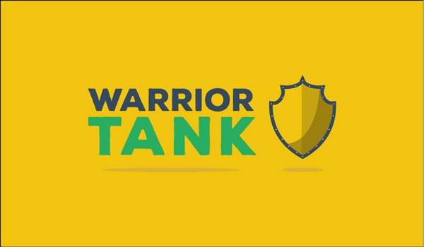

 

The boilerplate for frontend.

This boilerplate is a simple example used on my [workflow](https://github.com/meche/workflow).

## Install

1. Fork this repo;
2. install `nodejs`;
3. Clone in your environment the repo forked;
4. run package.json.

## Usage

run in your terminal `gulp warriorTank` for watch.
